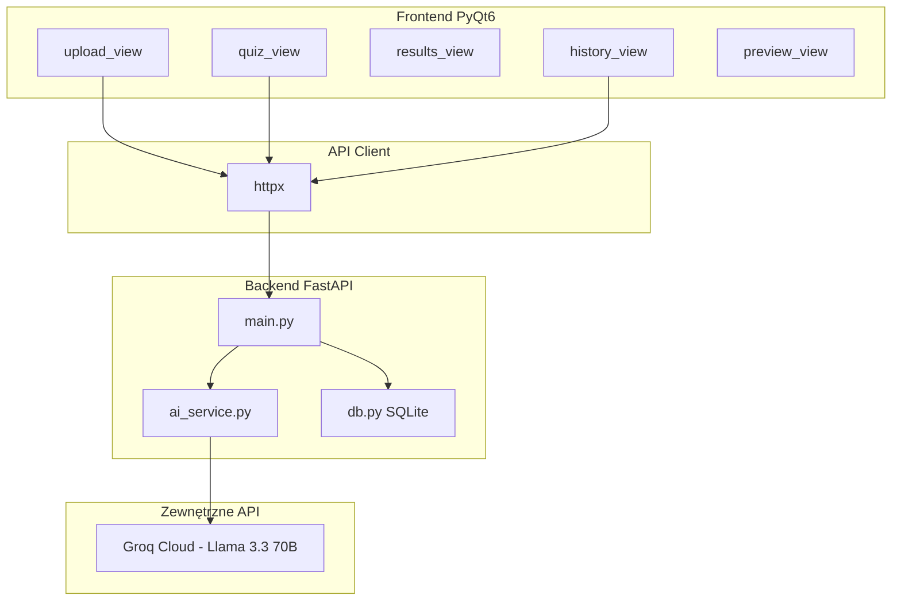

# AI Quiz Generator

Aplikacja desktopowa do automatycznego tworzenia i rozwiązywania quizów na podstawie dokumentów tekstowych (`.txt`, `.pdf`). Treść pliku jest analizowana przez model językowy, który generuje pytania jednokrotnego wyboru wraz z odpowiedziami i wyjaśnieniami.

## Funkcjonalności

- **Wgrywanie dokumentów** — obsługa plików `.txt` i `.pdf` (ekstrakcja tekstu przez pdfplumber)
- **Generowanie quizu (AI)** — konfigurowalna liczba pytań (1–20), po 4 odpowiedzi (A–D) na pytanie
- **Rozwiązywanie quizu** — interfejs PyQt6 z wyborem odpowiedzi
- **Wyniki i feedback** — liczba poprawnych odpowiedzi, procent, wyjaśnienia przy błędnych odpowiedziach
- **Historia quizów** — zapis w SQLite, podgląd, ponowne rozwiązanie, usuwanie
- **Eksport** — zapis quizu do PDF, DOCX lub TXT
- **Backend REST API** — FastAPI z endpointami do generowania, sprawdzania odpowiedzi i zarządzania historią

## Architektura



## Stack technologiczny

| Warstwa | Technologie |
|---------|-------------|
| Backend | FastAPI, Uvicorn, SQLAlchemy, Pydantic |
| Frontend | PyQt6, httpx |
| AI | Groq API (`llama-3.3-70b-versatile`) |
| Baza danych | SQLite (`data/quizzes.db`) |
| Parsowanie PDF | pdfplumber |
| Eksport | fpdf2, python-docx |
| Testy | pytest, pytest-cov |

## Struktura projektu

```
quiz_app/
├── backend/
│   ├── main.py          # endpointy FastAPI
│   ├── ai_service.py    # generowanie pytań (Groq + chunking)
│   ├── db.py            # SQLite / SQLAlchemy
│   └── models.py        # modele Pydantic i ORM
├── frontend/
│   ├── app.py           # główne okno aplikacji
│   ├── api.py           # klient HTTP do backendu
│   ├── upload_view.py   # wgrywanie dokumentu
│   ├── quiz_view.py     # rozwiązywanie quizu
│   ├── results_view.py  # wyniki
│   ├── history_view.py  # historia quizów
│   ├── preview_view.py  # podgląd i eksport
│   └── export_utils.py  # eksport PDF / DOCX / TXT
├── tests/
│   ├── test_api.py
│   ├── test_ai_service.py
│   └── test_db.py
├── data/                # baza SQLite (tworzona automatycznie)
├── run_backend.py       # uruchomienie serwera API
├── run_app.py           # uruchomienie GUI
├── requirements.txt
└── .env.example
```

## Wymagania

- Python 3.11+
- Klucz API Groq (darmowy tier: [console.groq.com/keys](https://console.groq.com/keys))

## Instalacja

```bash
cd quiz_app
python -m venv .venv

# Windows
.venv\Scripts\activate

pip install -r requirements.txt
```

## Konfiguracja

Skopiuj plik `.env.example` do `.env` i ustaw klucz API:

```env
GROQ_API_KEY=gsk_twoj-klucz-tutaj
```

Klucz uzyskasz po zalogowaniu na [console.groq.com/keys](https://console.groq.com/keys).

## Uruchomienie

Aplikacja składa się z dwóch procesów — backend i frontend uruchamiasz w **osobnych terminalach**.

**Terminal 1 — backend (API):**

```bash
python run_backend.py
```

Serwer startuje pod adresem `http://127.0.0.1:8000`. Dokumentacja interaktywna: `http://127.0.0.1:8000/docs`.

**Terminal 2 — frontend (GUI):**

```bash
python run_app.py
```

## API (backend)

| Metoda | Endpoint | Opis |
|--------|----------|------|
| `POST` | `/generate-quiz` | Wgrywa plik, generuje quiz (multipart: `file`, `num_questions`) |
| `POST` | `/check-answers` | Sprawdza odpowiedzi użytkownika |
| `GET` | `/quizzes` | Lista quizów z historii |
| `GET` | `/quizzes/{quiz_id}` | Szczegóły pojedynczego quizu |
| `DELETE` | `/quizzes/{quiz_id}` | Usuwa quiz z historii |

Przykładowa struktura pytania zwracana przez AI:

```json
{
  "question": "Treść pytania?",
  "answers": ["A) ...", "B) ...", "C) ...", "D) ..."],
  "correct": "B",
  "explanation": "Krótkie wyjaśnienie poprawnej odpowiedzi."
}
```

## Testy

```bash
pytest
pytest --cov=backend --cov-report=term-missing
```

Testy obejmują warstwę API, bazę danych oraz logikę `ai_service` (z mockowaniem wywołań Groq).

## Jak działa generowanie pytań

1. Tekst z pliku jest dzielony na fragmenty (**chunking**, domyślnie 3000 słów z overlapem 200), aby nie przekraczać limitów modelu.
2. Dla każdego fragmentu wysyłane jest zapytanie do Groq z promptem wymuszającym odpowiedź w formacie JSON.
3. Przy błędzie rate limit (429) stosowany jest **exponential backoff** (do 5 prób).
4. Wygenerowane pytania są walidowane (Pydantic) i zapisywane w SQLite.

## Uwagi

- **Groq API** — darmowy tier ma limity zapytań na minutę i dzień; przy częstym użyciu może pojawić się błąd 429 — odczekaj chwilę i spróbuj ponownie.
- Plik `.env` nie jest commitowany (patrz `.gitignore`).
- Baza `data/quizzes.db` tworzy się automatycznie przy pierwszym uruchomieniu backendu.

## Licencja

Projekt edukacyjny — do użytku w ramach nauki i rozwoju.
